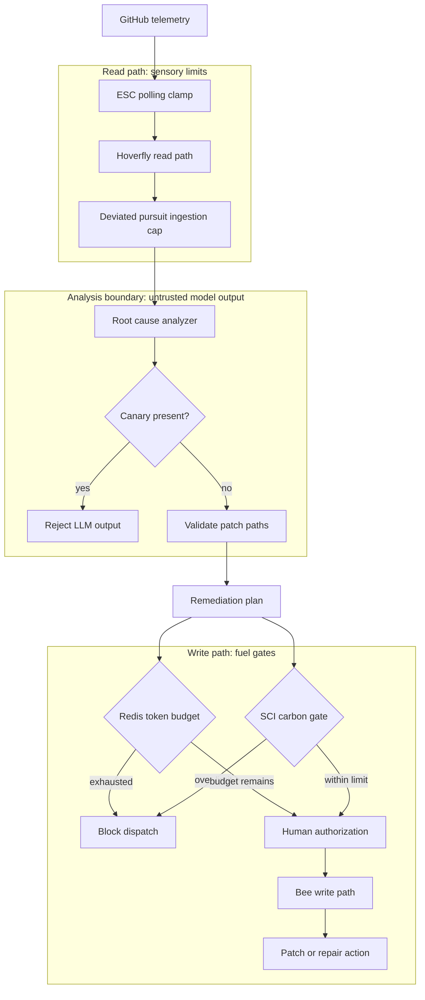

## Executive Summary

- Unbounded agent loops fail mathematically and operationally as task chains lengthen and retries compound.
- Agentic orchestration can materially increase token spend, translating directly into infrastructure and energy cost.
- The practical response is to bound read paths, bound write paths, and preserve human authorization.
- This post outlines a biomimetic control pattern inspired by fixed-energy biological systems.
- I implement this pattern in Fly Island using Extremum Seeking Control (ESC) polling clamps, deviated-pursuit ingestion bounds, Redis token budgets, and SCI-aware dispatch gates.

## Who This Is For

This post is for platform engineering, SRE, DevEx, FinOps, and AI governance teams that are shipping agentic workflows and need cost, reliability, and sustainability controls.

# The Physical Limits of Generative Compute

Autonomous swarms can exhaust infrastructure budgets and physical resources when left unbounded. Gartner projects worldwide AI spending will reach $2.59 trillion in 2026, with infrastructure consuming more than 45 percent of this total (Gartner). In parallel, parts of the technology sector are funding AI expansion alongside workforce reductions. In the first half of 2026, the industry announced 139,156 job cuts, an 83 percent increase from the prior year. Employers attributed 101,743 of those reductions to artificial intelligence (Challenger, Gray & Christmas).

To secure digital and physical ecosystems, we need engineering patterns that treat energy, latency, and failure as first-class constraints. This post proposes a transition to biomimetic engineering, an architectural paradigm that aligns computational behavior with thermodynamic limits found in the natural world. I then ground this thesis in Fly Island, a concrete implementation that demonstrates how biomimetic orchestration can reduce systemic failure modes in generative compute.

## The Mathematical Failure of Unbounded Agents

Many current deployments still rely on unchecked design patterns. Teams often route routine problems through recursive agent loops and assume reliability will hold under iteration. That assumption treats cognition as free and electricity as invisible.

This architectural logic fails in three ways. First, compound error. Run ten steps in series and each step must succeed for the task to succeed. Multiply the per-step odds: 0.85 × 0.85 × 0.85, ten times. That is 0.85^10, or about 19.7%. An agent that looks 85% reliable on a single call fails four out of five times on a ten-step job. One early mistake breaks every subsequent step. The agent cannot recognize the root failure and keeps trying to execute on a broken state. Every doomed retry simply burns more grid power, API quota, and the engineer’s bandwidth (Rajan).

Second, quadratic token burn. Naive agent loops tend to re-bill the entire conversation history on every execution step, forcing a quadratic token cost curve. A standard 20-step agent loop can consume over 210,000 cumulative input tokens as tool outputs and reasoning traces accumulate in the context window (Augment Code). This architecture artificially drives up infrastructure costs.

Infinite Agentic Loops (IALs) create a third structural trap. Without termination bounds or repetition tracking, agents re-enter the same feedback paths. In practice, the harness often lacks a hard stop condition, so loops can persist beyond useful work. Teams sometimes deploy agents without validated tool contracts and without bounded contexts, leaving completion messages as the only output signal. Cloudzy and Wen et al. document this behavior as reward hacking.

Unbounded swarms tend to drift toward brute-force search and coordination overhead. Multi-agent orchestration can consume 4.3 to 4.6 times the tokens of an equivalent single-agent workflow due to inter-agent communication alone (NexGismo). One documented LangChain Analyzer/Verifier pair ran 11 days and billed roughly $47,000 before alerts fired (NexGismo; Vectara awesome-agent-failures).

## Token Economics and Physical Infrastructure

During the Morgan Stanley Technology, Media & Telecom Conference in March 2026, Nvidia CEO Jensen Huang characterized data centers as AI factories whose main output is tokens. He asserted that because growth is restricted by power-constrained infrastructure, tokens per watt, the amount of compute delivered per unit of energy, has risen to a critical executive-level efficiency metric. Measured benchmarks find that agentic coding tasks consume roughly 1,000 times more tokens than single-pass code chat on the same workloads (Microsoft Research).

Tokens cost watts which draw from the power grid. Industry projections reported that U.S. data center water consumption will be near one trillion liters annually by 2025, with a significant portion dedicated to evaporative cooling processes. In the 2027/2028 Base Residual Auction, the PJM Interconnection procured 6,623.2 megawatts less than the installed reserve margin target and 6,516.6 megawatts below the RTO Reliability Requirement (PJM Interconnection). This marked the first time the entire RTO, including Fixed Resource Requirement areas, fell short of the reliability requirement since the capacity market began in 2007 (PJM Interconnection). PJM reported that forecasted load rose 5,249.9 MW year over year, largely due to additional large loads; PJM's December 17 press release attributed nearly 5,100 MW of the peak-load increase to data-center demand (PJM Interconnection). Hyperscale operators (including Microsoft, Google, and Amazon) are material contributors to load growth in public reporting, while retail customers can still absorb downstream rate pressure, including documented increases in Illinois, a PJM state (Electrac).

Biological systems survive on fixed energy budgets. Software must copy this physical constraint to remain sustainable. This failure requires a new systemic engineering pattern. My platform, Fly Island, provides a concrete implementation of this pattern. It uses biomimetic orchestration to prove that agentic workflows can operate safely. Fly Island enforces limits at all execution layers. To regulate operational costs, the architecture employs Extremum Seeking Control to throttle polling and implements Deviated Pursuit logic to bound data ingestion. Furthermore, it utilizes Redis token management alongside Software Carbon Intensity measures to place hard limits on write operations and lessen carbon emissions.

# The Biological Precedent for Bounded Systems

Unrestrained agentic swarms fall off a cliff of unbounded ingestion, execution, and spend. Fly Island seeks to mitigate this hazard by implementing constraints at the source.

Biological organisms do not continuously poll their environment. They enforce strict processing limits to conserve fixed energy budgets. The mathematical framework of this efficiency is mirrored in the Hoverfly, *Syritta pipiens*, whose precise pursuit dynamics were characterized in the neuroethological findings of Collett and Land (1975).

## Extremum Seeking Control and Telemetry Limits

Fly Island maps hoverfly visual processing rates in the 160–230 Hz range to a software polling floor using Extremum Seeking Control (ESC). This adapts model-free flight stabilization frameworks from flapping micro-aerial vehicles ("Biologically Inspired Hovering").

Unrestricted network polling wastes compute. The Fly Island controller optimizes the telemetry polling baseline against measured network round-trip time. It integrates a low-pass-filtered gradient on each tick. The controller enforces a strict dual clamp.

```rust
// src/agent/esc_controller.rs
pub fn polling_interval_ms(&self) -> u64 {
    self.baseline_interval_ms.clamp(4.0, 200.0) as u64
}
```

The 4 ms polling floor sets the fast end of the ESC clamp, aligned with the upper bound of the hoverfly's documented 160–230 Hz visual processing range. The system does not spin out of control if an agent enters an idle branch lacking network data. It broadcasts the clamped interval without stepping the gradient. This design caps execution at the network source.

## The Deviated Pursuit Algorithm

Biological systems solved resource competition before software had a billing API.

The *Syritta pipiens* uses a specific deviated pursuit algorithm documented in classical neuroethological literature (Collett and Land). It intercepts targets efficiently, expending minimal kinetic energy. That math sets data ingestion rate on the read path and blocks API exhaustion during proximal pursuit.

```rust
// src/agent/deviated_pursuit.rs
// Biological Rules 1 & 2 - Syritta pipiens proximal pursuit (Collett & Land 1975)
// Rule 1: dtheta/dt = k1 * alpha
// Rule 2: V = (k * omega) / sin(alpha)
pub struct DeviatedPursuitController {
    theta_accumulated_rad: f64,
}
impl DeviatedPursuitController {
    pub fn compute(&mut self, alpha_rad: f64, omega: f64, dt_ms: f64) -> DeviatedPursuitOutput {
        // Rule 1 - steering rate toward the anomaly
        let angular_velocity_rad_per_ms = RULE1_GAIN_RAD_PER_MS_PER_RAD * alpha_rad;
        self.theta_accumulated_rad += angular_velocity_rad_per_ms * dt_ms;
        // Rule 2 - ingestion rate; 1 degree floor prevents division by zero
        let alpha_clamped = alpha_rad.abs().max(ALPHA_MIN_RAD);
        let ingestion_rate_samples_per_ms =
            (DEVIATED_PURSUIT_K * omega.abs()) / alpha_clamped.sin();
        // Caller clamps to [1, ANOMALY_BURST_CAP] before draining events
        DeviatedPursuitOutput { /* angular_velocity, ingestion_rate, theta */ }
    }
}
```

This code applies both proximal hoverfly rules from the literature. Rule 1 governs steering rate; Rule 2 governs data ingestion rate. Production clamps alpha to a 1 degree minimum, not a zero return, then clamps ingestion to [1, 16] events per tick before draining the anomaly channel. The orchestrator stays within sensory bounds without invoking token-heavy reasoning models.

## The Architecture of the Hive

Unbounded agent swarms run unchecked because they lack operational boundaries. The result is a wasted infrastructure budget. To survive, we implement bounded contexts that control agent behavior at the source. The centralized coordination of an AI Hive structurally differs from the decentralized brute force of a swarm. Hives build engineering guardrails from the very beginning.



The sequence is intentionally bounded. Telemetry enters through the read path, where ESC and Deviated Pursuit constrain polling and ingestion. The analyzer can propose a repair, but model output remains untrusted until it passes canary and path validation. Write actions then face fuel gates: Redis token budget, SCI carbon threshold, and human authorization.

### Defense in Depth: Read Path and Write Path Isolation

Effective boundaries require strict isolation between system layers. Sensory throttling on the read path shares no state with write-path fuel gates. Because the Deviated Pursuit limits, the Redis token budget, and the SCI rate gate lack a programmatic bridge, one layer can trip while the others remain active. This mechanical separation creates true defense in depth.

### Sensory Throttling on the Read Path

The Deviated Pursuit controller operates strictly on the read path. It governs the data ingestion rate during the proximal pursuit state, matching motion camouflage and shadowing during close-range tracking (Justh and Krishnaprasad).

During each execution tick, the controller calculates a specific ingestion rate. The system clamps this rate between a firm floor and a hard ceiling (a burst cap of 16 anomalies). The orchestrator drains events from the receiver only up to this effective burst cap. This cap establishes a strict sensory ceiling, preventing unchecked webhook noise from overwhelming the state machine.

### Financial Gates on the Write Path

The Redis token gate operates independently on the write path. A configured daily token budget acts as the absolute dispatch boundary. Setting this limit above zero enforces the boundary. Setting the limit to zero disables the gate entirely, providing an unlimited override.

Before dispatching a repair plan, the system evaluates the daily token budget. It atomically subtracts from a per-repository counter using a Redis gate. Budget exhaustion triggers a fail-closed state, while infrastructure errors trigger a fail-open state.

1. The system deducts the execution cost from the daily counter.
2. Dispatch proceeds if the remaining balance is zero or higher.
3. If the balance falls below zero, the gate blocks the dispatch. The system immediately restores the counter to prevent underflow and logs a warning.
4. If the Redis database drops offline, the system allows the dispatch to proceed. This fail-open design ensures a backend infrastructure outage does not halt critical repairs.

The biological model defines this state as fuel exhaustion. An organism cannot forage without physical energy. The software cannot dispatch repairs without an active token budget.

**SCI Budget Gate on the Write Path**

Fly Island separates operations into distinct biological models. The Hoverfly manages the read path for sensory ingestion. The Bee manages the write path for executing repairs. A second gate on the write path blocks the Bee from dispatching a patch if the local grid's estimated carbon intensity exceeds a configured maximum rate. This Software Carbon Intensity (SCI) gate operates independently of the token budget. If tripped, the system blocks remediation and automatically slows its polling rate to reduce grid draw during the carbon overrun.

### Prompt Injection and Structural Guardrails

Structural boundaries trigger before data reaches the patch dispatch phase. Unchecked LLM outputs introduce immediate risk.

The Root Cause Analyzer scans the raw LLM response string for an embedded token constraint (CANARY_8A3F). The system discards the response entirely pre-deserialization if the canary is present. This presence indicates a prompt injection or hallucination breach. Surviving payloads then pass through a strict validation check containing eight rules. These rules explicitly block path traversal, null bytes, and CI workflow modifications.

### Thermodynamic Cost Tracking

The cost engine records thermodynamic spend inside the CI pipeline. It isolates per-job durations, applies OS cost multipliers, and maps effective runtime through a sourced power curve. Baseline constants: CPU TDP 37.5 W, utilization factor 0.40, facility PUE 1.2.

(37.5 × 0.40 × 1.2) / 60,000 = 0.0003 kWh per effective runner-minute.

Total effective runner minutes times 0.0003 yields estimated workflow energy. Bounded polling and burst caps cut runner-minutes and grid draw.

**Circular Compute and the Human Orchestrator**

## Waste Heat and Edge Architecture

Data centers generate extreme waste heat during heavy model orchestration. Expanding data centers to support continuous AI compute strains municipal resources. Jha et al., citing The Economist (2024), estimate GPT-4 training energy on the order of powering 50 American homes for 100 years (order-of-magnitude estimate, not a metered training log). Data centers expend about 40 percent of their electricity on computing. The remaining 60 percent powers non-computing systems; of that share, roughly 40 percent goes to HVAC and about 20 percent to power delivery, fans, and IT drivers (Jha et al.). Google's Hamina site captures server waste heat to cover about 80 percent of annual district heating demand in Hamina, Finland (Google). Heat recovery works at known sites. It is not default everywhere.

Push orchestration toward edge devices where models fit locally. An edge node cannot replace a regional cloud. A central orchestrator can still coordinate many edge nodes.

## The Exocortex

Fly Island is an exocortex, not an automated replacement. Biological systems survive because they rest and shut down. Corporate software expects indefinite digital uptime. This continuous operation degrades physical environments. Fly Island discovers system failures and maps resource constraints, then reports them for human judgment. In shadow mode (`disable_bee_writes`), Bee write tools do not execute: analysis runs, dispatch does not. The farmer chat panel explains current HoverflyState in biological terms. Operator kill switches, admin endpoints, and budget configuration keep the human as the orchestrator who sets boundaries and authorizes live repair. Fly Island defines the math. The operator authorizes the spend.

**Enterprise Adoption**

Platform engineering teams can adopt biomimetic constraints today. The transition requires moving away from unbounded multi-agent swarms and implementing hard systemic gates. Follow this three-layer pattern to secure enterprise architectures.

1. Do not let agents ingest unlimited webhook noise. Bind network polling to network latency using Extremum Seeking Control. Clamp the anomaly ingestion rate to a hard ceiling.
2. Decouple agent reasoning from the execution of tool calls. Force every patch dispatch or write action to pass an independent token-budget check via a fast in-memory store like Redis. Default to a fail-closed posture on budget exhaustion.
3. Design systems as an exocortex. Use AI to analyze failures and propose remediations, but require human authorization for deployment.


## Biological Symbiosis

Organisms need rest. Software that assumes infinite uptime pushes cost onto power grids and water systems. Unbounded agent deployment is a systemic hazard. Fly Island proves that we can cap reads, writes, tokens, and carbon while keeping the human in control. We must steward these systems intentionally. We cannot allow unchecked compute to consume the physical world.

## More Is Coming Soon

Fly Island is still ongoing work. I am publishing the architecture first :) The repository and deeper implementation notes will come when the system is ready for public review.

# References

1. Augment Code. "AI Agent Loop Token Costs: How to Constrain Context." 2026.
2. "Biologically Inspired Hovering Flight Stabilization for the Flapping Wings Micro Air Vehicles." Institute of Aviation, 2005.
3. Challenger, Gray & Christmas. "Challenger Report: June Layoffs." July 2026.
4. Cloudzy. "Why AI Agent Loops Fail in Production: 6 Harness Fixes." 2026.
5. Collett, T. S., and Land, M. F. "Visual Control of Flight Behaviour in the Hoverfly Syritta Pipiens L." Journal of Comparative Physiology, 1975. doi:10.1007/BF01464710.
6. Electrac. "AI Data Centers Driving Up Illinois Electric Costs." 2026. https://electrac.app/blog/ai-data-centers-illinois-electricity-costs
7. Gartner, Inc. "Gartner Forecasts Worldwide AI Spending to Grow 47% in 2026." May 2026.
8. Google. "Our First Offsite Heat Recovery Project Lands in Finland." The Keyword, 21 May 2024.
9. Huang, Jensen. "Fireside Chat." Morgan Stanley Technology, Media & Telecom Conference, Mar. 2026.
10. Jha, R., et al. "Forecasting US Data Center CO2 Emissions Using AI Models: Emissions Reduction Strategies and Policy Recommendations." Frontiers in Sustainability, vol. 5, 2024. Published 2025. doi:10.3389/frsus.2024.1507030.
11. Justh, E. W., and P. S. Krishnaprasad. "Steering Laws for Motion Camouflage." Proceedings of the Royal Society A, vol. 462, 2006, pp. 3629–3643. doi:10.1098/rspa.2006.1742.
12. Microsoft Research. "How Do AI Agents Spend Your Money? Analyzing and Predicting Token Consumption in Agentic Coding Tasks." 2025.
13. NexGismo. "AI Agent Budget Guards: How to Stop Runaway API Costs." 2026.
14. NexGismo. "AI Agent Orchestration: One Agent or Many? A Practical Guide for Developers." 2026.
15. PJM Interconnection. "2027/2028 Base Residual Auction Report." 17 Dec. 2025.
16. PJM Interconnection. "Markets." Annual Report 2025. https://services.pjm.com/annualreport2025/markets/
17. PJM Interconnection. "PJM Auction Procures 134,479 MW of Generation Resources." Inside Lines, 17 Dec. 2025.
18. Rajan, K. "The Math That's Killing Your AI Agent." Towards Data Science, 2026.
19. Space Daily. "AI Did Not Just Demand More Electricity." 2025.
20. Vectara. "LangChain A2A $47K Infinite Loop." awesome-agent-failures, 2026. https://github.com/vectara/awesome-agent-failures/blob/main/docs/case-studies/langchain-a2a-47k-infinite-loop.md
21. Wen, et al. "When Agents Do Not Stop: Uncovering Infinite Agentic Loops in LLM Agents." arXiv:2607.01641, 2026.