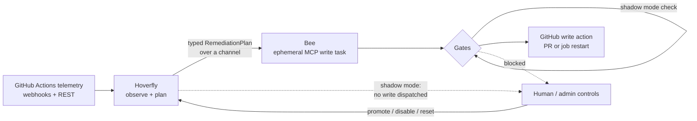

*A solo-built platform for observing CI failures, costing them, and remediating them only inside hard bounds.*

---

Fly Island is a solo-built AgentOps platform, written in Rust, that watches GitHub Actions pipelines, calculates the real dollar and carbon cost of every run, and remediates failures only under explicit operational bounds. A persistent observer agent (Hoverfly) detects anomalies and works out root cause, but it has no access to any write tool, so it can't act on what it finds even if it wanted to. When remediation looks warranted, Hoverfly hands a typed plan to a separate, short-lived worker agent (Bee), which is the only component that can execute the plan through the Model Context Protocol (MCP), and Bee exits once it's done. The reason for the split is that reasoning and execution shouldn't share the same privileges: if the LLM hallucinates or gets manipulated by prompt injection, it still has no path to a GitHub write call. The system ships in shadow mode by default, so it can observe, classify, and draft remediation plans in production without ever touching a live repository, until a promotion gate confirms it's safe to enable writes. Everything below describes what's actually implemented, not a roadmap.

---

## Architecture



Hoverfly and Bee only talk to each other through a typed message passed over a channel, not through shared memory. Any of the gates in the middle box can independently stop a dispatch, and a human operator can disable writes or reset the circuit breaker at any time without restarting anything.

---

## Agent roles

- **Hoverfly** is the persistent observer and planner. It runs continuously, watches the telemetry stream, and produces a `RemediationPlan`, but it has no write access at all. Keeping this agent long-lived and side-effect-free means its reasoning can be inspected, replayed, and rate-limited without any risk of an accidental production write.
- **Bee** is the ephemeral executor. It's spawned once per remediation, consumes exactly one plan, calls exactly one MCP write tool, terminates, and keeps no memory across runs. Keeping the execution surface this narrow limits the damage of any single bad decision to one action.
- **Farmer** is the conversational interface over live agent state. It answers operator questions about what the system is currently doing and why, in terms of the underlying control state, and it reports a confidence score instead of presenting a guess as settled fact. It doesn't plan or execute anything itself, and its job is just to explain what the other two agents are doing.

The point of the three-way split is that the agent with the most situational awareness (Hoverfly) never gets write access, the agent with write access (Bee) never gets much awareness, and the agent a human talks to (Farmer) doesn't get either.

---

## Safety and reliability guardrails

Everything below is implemented and enforced by an automated test, not aspirational:

- **Architecture boundary**: the reasoning module can't import the MCP/write module. An architecture test enforces this directly, not just a code review convention.
- **Write-path allowlist re-validation**: any proposed file patch is re-checked against an explicit path allowlist right before dispatch, independent of the upstream reasoning step, so a patch to a non-allowlisted path gets downgraded to a safe restart even if the upstream check were somehow bypassed.
- **Prompt-injection canary check**: LLM responses are scanned for a canary token before they're deserialized into a remediation plan. A hit rejects the response, counts toward a rejection metric, and trips the circuit breaker instead of letting the response proceed.
- **LLM circuit breaker**: after repeated failures, the breaker opens and the agent falls back to a safe restart strategy (no PR creation) until a half-open trial call succeeds. This keeps a degraded model provider from getting hammered with retries.
- **Shadow mode by default**: write actions are disabled out of the box. The full remediation pipeline runs end to end, including plan generation, but the actual network write gets intercepted, so the system can be validated against live traffic with zero write risk.
- **Promotion gate**: moving from shadow to live mode requires an explicit check across several independent signals (no dropped events, no stuck channels, a closed circuit breaker, and at least one real detection observed) before writes get enabled at all.
- **Daily token/cost budget gate**: a per-repository budget on LLM token spend is enforced before a remediation task can run, and exhausting it blocks further dispatch until the budget resets.
- **Carbon (SCI) budget gate**: a remediation plan whose estimated carbon cost exceeds a configured ceiling gets blocked instead of dispatched, and the block is visible to an operator.
- **Admin kill switch**: writes can be disabled instantly through an authenticated endpoint, with no restart required, and the disabled state shows up as a metric.

Everything in this list ships behind tests. None of it is a "coming soon" feature described as if it already runs.

---

## Cost and carbon controls

Fly Island uses US dollar cost and Software Carbon Intensity (SCI, the Green Software Foundation's per-execution carbon metric) as gates the system checks before it acts, not as numbers on a dashboard nobody looks at. Every pipeline run produces a cost report with billable runner minutes, estimated kilowatt-hours, and an SCI rate, and if a report can't compute a carbon rate, it gets treated as incomplete and doesn't get surfaced to the frontend. The SCI formula follows the standard Green Software Foundation definition:

```
SCI = ((E × I) / 1000 + M / 1000) / R    [kgCO2eq per execution]
```

where `E` is energy consumed, `I` is the grid carbon intensity for the runner's region, `M` is embodied carbon, and `R` is the functional unit (one pipeline execution). Regional grid-intensity values are configuration, not hardcoded constants, so they can be updated as better regional data becomes available. There are no invented "X% savings" numbers here. The system reports what a run cost and what it emitted, and it blocks a remediation when either number crosses a configured budget.

---

## Stack

Rust (Tokio async runtime, Axum for HTTP/WebSocket), React Flow on TypeScript for the frontend canvas, Redis for lease coordination and budget counters, Docker and GKE for deployment, Prometheus and OpenTelemetry for observability, GitHub Actions webhooks and REST API for telemetry, and the Model Context Protocol for the agent write path.

The agent execution path (detection, planning, remediation) is Rust-only by design, with no Python, Node.js, Go, or Java anywhere in that path. This is a deliberate constraint chosen for predictable latency (no GC pauses in the control loops) and a smaller attack surface at the write boundary, not an accident of what got written first.

---

## Read more

The essay behind the design decisions: [Biomimetic engineering: capping the physical cost of unbounded AI](https://lara-sundare6.github.io/category/2026/07/10/biomimetic-engineering-capping-the-physical-cost-of-unbounded-ai.html)

An architecture walkthrough, including the control algorithms behind anomaly detection and the test harness that enforces the boundaries above, is available on request or in an interview.
