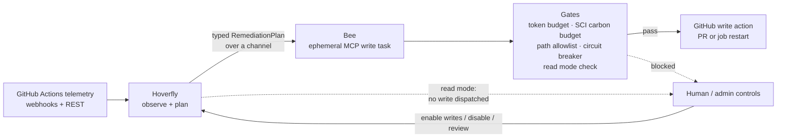

*A solo-built platform for observing CI failures, costing them, and remediating them only inside hard bounds.*

---

Fly Island is a solo-built AgentOps platform, written in Rust. It watches GitHub Actions pipelines, calculates the dollar and carbon cost of every run, and remediates failures only inside hard operational bounds.

A persistent observer agent (Hoverfly) detects anomalies and works out their root cause, but it has no write access. When remediation looks warranted, the Hoverfly hands a typed plan to a short-lived worker (Bee). The Bee is the only component that can execute through the Model Context Protocol, and it exits when the work is done. That way, reasoning and execution do not share privileges. If the model hallucinates or is prompt-injected, it won't have a path to a write on GitHub.

The system ships in read mode by default. It can observe, classify, and draft plans without touching a live repository until writes are deliberately turned on.

---

## Architecture



Hoverfly and Bee exchange a typed message over a channel. They do not share memory. Each gate can stop a dispatch on its own. An operator can disable writes or review system state without restarting the process.

---

## Agent roles

- **Hoverfly** observes the telemetry and produces a Remediation Plan if needed. It stays long-lived and side-effect-free, so its reasoning can be inspected, replayed, and rate-limited without risking a write in production.
- **Bee** runs once per remediation. It consumes one plan, calls one MCP write tool, then stops with no memory across runs so that one bad decision will produce at most one action.
- **Farmer Chat** answers operator's questions about live control state. It reports a confidence score instead of presenting a guess as fact. It does not plan or execute.

Hoverflies have the most context and no write access. Bees have write access and almost no lasting context. Farmer Chat talks to humans.

---

## Safety and reliability guardrails

These controls are running and tested:

- **Architecture boundary.** The reasoning module cannot import the MCP write path. `agent_module_does_not_import_mcp` enforces that in `tests/architecture.rs`.
- **Write-path allowlist.** Bee re-checks every patch path at dispatch. An adversarial `/etc/passwd` path is downgraded to `RestartJob` instead of opening a PR.
- **Prompt-injection canary.** A response containing `CANARY_8A3F` is rejected and counts toward opening the circuit breaker.
- **LLM circuit breaker.** After repeated failures, the breaker opens. The agent falls back to safe restarts (no PR creation) until a half-open trial succeeds.
- **Read mode by default.** `APP_DISABLE_BEE_WRITES` defaults to `true`. The pipeline still plans end to end; the write is intercepted on the tested dry-run path.
- **Before writes are turned on.** Writes stay off until independent eligibility checks pass. CI covers unauthorized and ineligible requests to enable them.
- **Daily token budget.** Exhausting the per-repository LLM budget blocks further dispatch until the budget resets.
- **Carbon (SCI) budget.** A plan whose estimated carbon cost exceeds the configured ceiling is blocked.
- **Admin kill switch.** An authenticated endpoint disables writes immediately, with no restart.

From CI run `28970279383` at SHA `de23615` (Ubuntu 24.04):

```text
2026-07-08T19:37:57.9432105Z test agent::root_cause_analyzer::tests::canary_injection_increments_rejected_and_trips_cb ... ok
2026-07-08T19:37:58.2192531Z test tasks::bee_consumer::tests::revalidate_allowlist_downgrades_non_allowlisted_create_pr ... ok
2026-07-08T19:38:03.4105452Z test agent_module_does_not_import_mcp ... ok
2026-07-08T19:37:58.8400657Z test result: ok. 205 passed; 0 failed; finished in 1.14s
```

### A failure that changed the design

The first LLM parser used Serde's `deny_unknown_fields`. Real model responses included extra `reasoning` fields and broke deserialization. That rule came out. Extra fields are tolerated now. What can execute is still bounded by the canary, path validation, and Bee's final allowlist.

---

## Cost and carbon controls

Dollar cost and Software Carbon Intensity (SCI) are gates before dispatch, not decoration. An approved fixture for a ten-minute Linux run:

```yaml
# I = 386 gCO2/kWh (us-east)
billable_minutes_linux: 10
estimated_kwh: 0.003
sci_rate: 0.001658
total_cost_usd: 0.08
```

A blocked fixture uses a 120-minute macOS run with `sci_rate: 0.00055584` against `max_sci_rate_per_bee: 0.0001`. The outcome is `RemediatingBlocked / SciBudget`. Both fixture tests passed in the CI run above.

```
SCI = ((E × I) / 1000 + M / 1000) / R    [kgCO2eq per execution]
```

`E` is energy, `I` is regional grid intensity, `M` is embodied carbon, and `R` is one pipeline execution. Grid intensity is configuration. The fixtures include a `configured_override` for `europe-west1`.

---

## Stack

Rust (Tokio, Axum), React Flow on TypeScript, Redis, Docker and GKE, Prometheus and OpenTelemetry, GitHub Actions webhooks and REST, MCP for the agent write path.

The agent execution path is Rust-only. An earlier Python MCP echo helper was removed and replaced with a Rust `EchoMcpTransport`. That choice is about predictable latency and a smaller write-boundary surface, not about what got written first.

---

## Read more

The essay behind the design decisions: [Biomimetic engineering: capping the physical cost of unbounded AI](https://lara-sundare6.github.io/category/2026/07/10/biomimetic-engineering-capping-the-physical-cost-of-unbounded-ai.html)

An architecture walkthrough of the control algorithms and test harness is available on request or in an interview.
